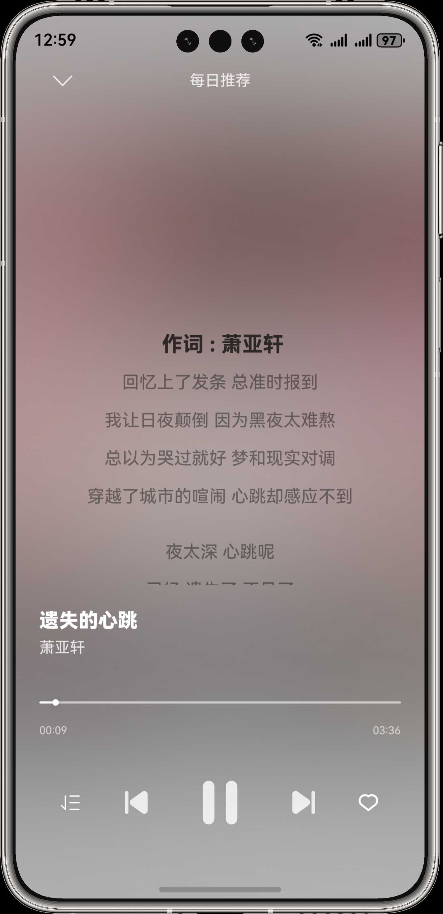
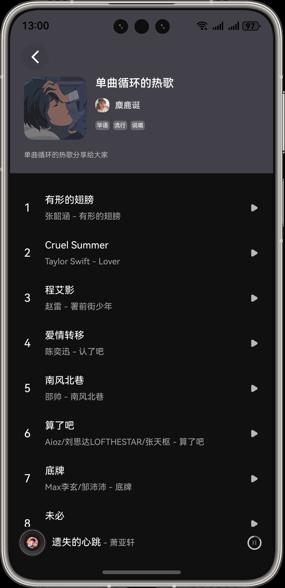
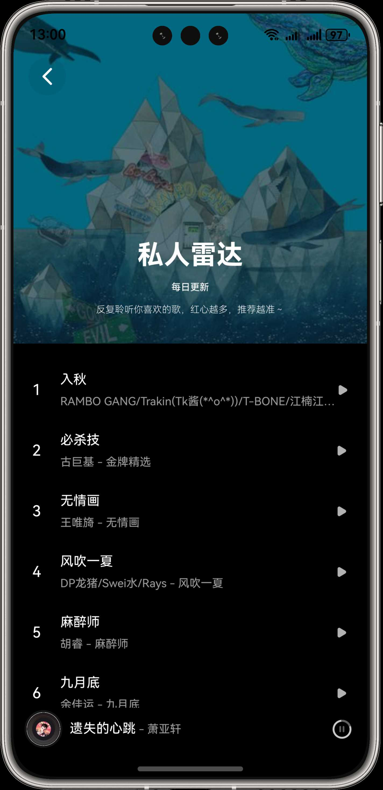

## 模仿网易云音乐-鸿蒙版本-OpenHarmony

> 警告：⚠️ 本项目仅用于开发鸿蒙应用的学习交流使用，请勿用于任何商业/非法用途。

## 功能列表

- [x] 首页列表
- [x] 播放器页
- [x] 歌词
- [x] 歌单页
- [x] 接入鸿蒙播控组件
- [x] 切换音质
- [x] 搜索歌曲
- [x] 边听边存
- [x] 登录页面
- [x] 黑夜模式
- [x] UI 沉浸
- [x] 歌单收藏
- [x] 个人中心页
- [ ] 播放列表
- [ ] 创建歌单
- [ ] UI 动画

## 预览

|                    首页                     |                  播放器页                   |                  播放器页                   |
| :-----------------------------------------: | :-----------------------------------------: | :-----------------------------------------: |
|  |  |  |
|                播控组件效果                 |                歌单页-样式 1                |                歌单页-样式 2                |
|  |  |  |

## 使用包

| 包                      | 说明          |
| :---------------------- | :------------ |
| @ohos/axios             | http 网络通讯 |
| @ohos/crypto-js         | 加密解密库    |
| dayjs                   | 时间日期库    |
| @seagazer/cclyric       | 歌词组件      |
| @ohos/imageknife        | 图片缓存组件  |
| ohos_tinycolor2         | 色彩解析库    |
| @ohos/qr-code-generator | 二维码生成库  |
