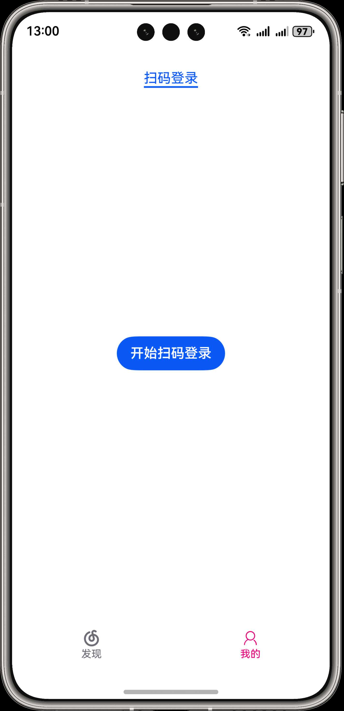

## 网易云音乐-鸿蒙版本-OpenHarmony

> 警告：⚠️本项目仅用于开发鸿蒙应用的学习交流使用，请勿用于任何商业/非商业用途。

## 功能列表
- [x] 首页列表
- [x] 扫码登录
- [x] 播放器页
- [x] 歌词
- [x] 歌单页
- [x] 接入鸿蒙播控组件
- [ ] 搜索歌曲
- [X] 切换音质

## 预览

|                     首页                      |                    播放器页                     |                    播放器页                     |
|:-------------------------------------------:|:-------------------------------------------:|:-------------------------------------------:|
|  |  |  |
|                   播控组件效果                    |                   歌单页-样式1                   |                   歌单页-样式2                   |
|  |  |  |
|                     登录页                     |                                             |                                             |
|  |                                             |                                             |